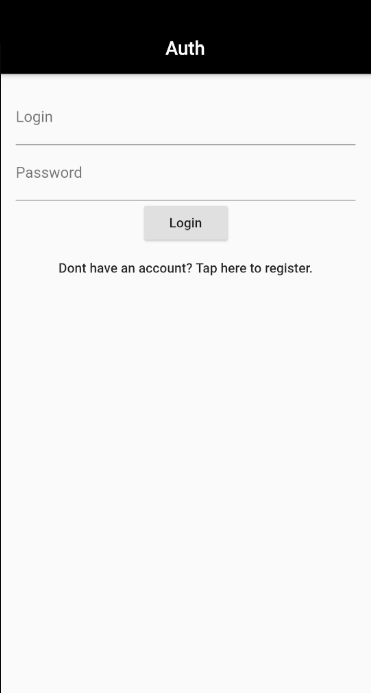
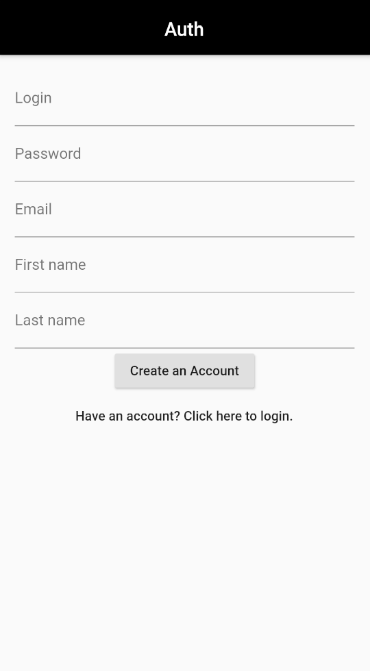
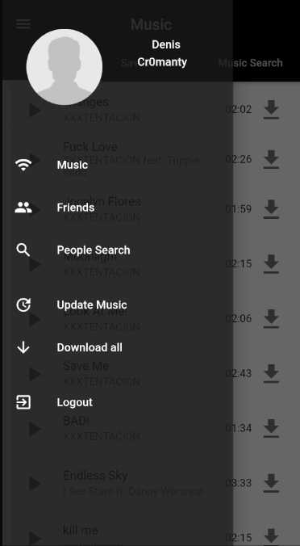
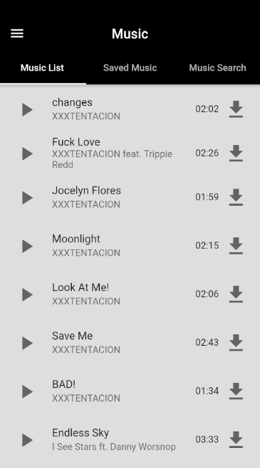

# VK Music App

Parse music from VK and show in app

## UI preview
1. Intro page is designed to perform basic
 addressing of pages and determine user authorization.
  
 
 
2. Auth page is required for authorization and for registering a new user.
 
 
 

3. The application also has an App Bar Menu, in which you can switch between pages 
and update the list of tracks or download all the tracks that have already been 
associated with the user account. Also, a little data about the user is displayed on top
(picture, first name and last name).
 
 

4. The Music page has 3 tabs. The first tab is responsible for the list of music that has been 
added to the application server and receives it using the request API. 
The second displays a list of already downloaded songs.
The third, in turn, exists to search for tracks among all existing ones (To be added later).
 
 
