# Fox Music 

An application for using music with the ability to download from the cloud and save it in the phone’s memory. Convenient storage of tracks in one place,
allows you to listen to your favorite tracks offline, and the creation of playlists will allow you to distribute tracks into a variety of categories 
and for every taste of the listener.

## UI preview
1. Launching the application opens the playlist tab, where the user can add а new playlist giving him a name.
 
<table>
  <tr>
    <td>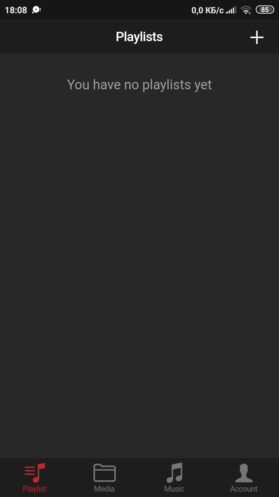</td>
    <td>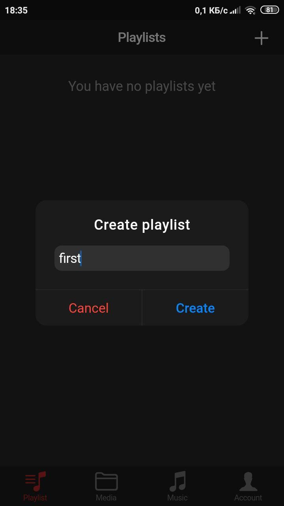</td>
  </tr>
 </table>

2. The tab "Media" is designed to store tracks that were downloaded from the cloud.
  
 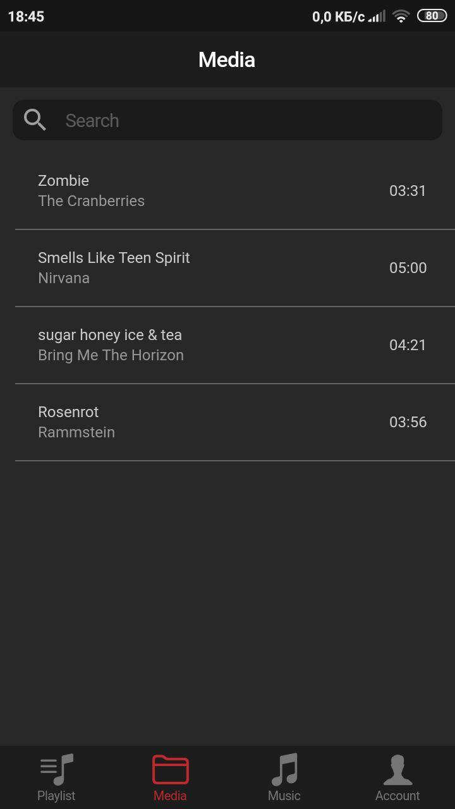

3. The tab "Music" is used to search for network music and download it to your device. After downloading it will be stored in the "Media" tab.
 
 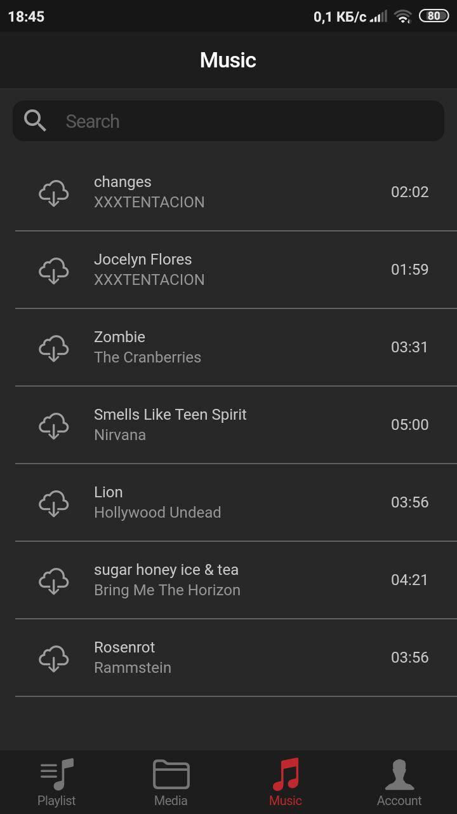
 
4. The tab "Account" is required for authorization and for registration of a new user.
After registering an account, a profile opens on which there are buttons: "Search for music", "Search for friends", "Friends" and "Download all".
 
<table>
  <tr>
    <td>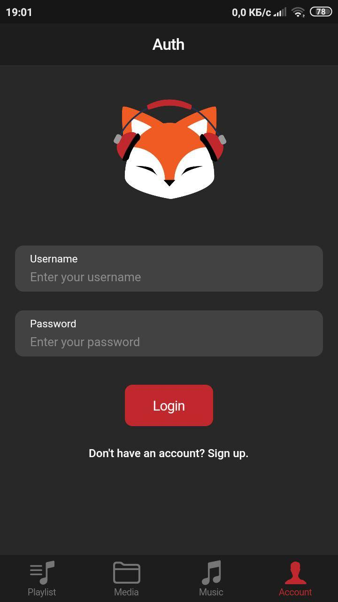</td>
    <td>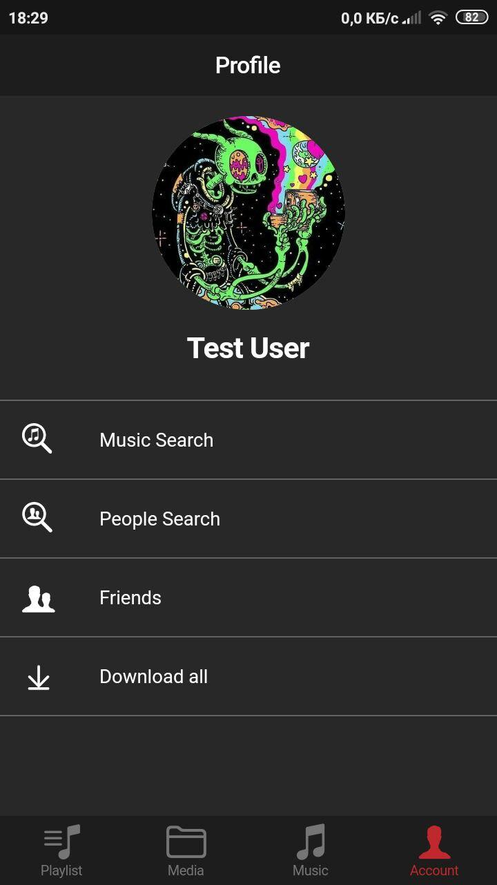</td>
    <td>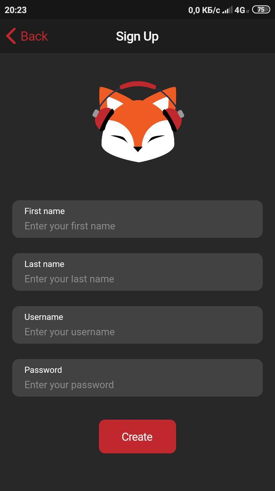</td>
  </tr>
 </table>
  
5. The player has the ability to stop the track, return to the previous one, or go to the next, repeat and shuffle the tracks.
At the bottom of the player is the volume control bar, adding a track to the playlist and the ability to add lyrics.
   
  <table>
  <tr>
    <td>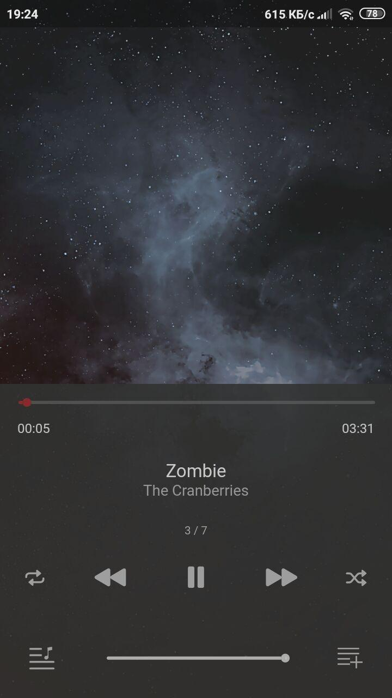</td>
    <td>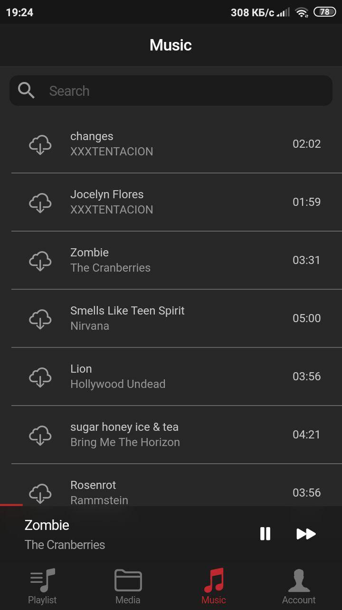</td>
  </tr>
 </table>

6. Downloading music is accompanied by animation on the track
  
 
 
### Small functionality of the application for music:

1.	When you swipe music to the left or right, additional functions are shown, such as "Add to playlist", "Rename", "Share" and "Delete".
    
 <table>
  <tr>
    <td>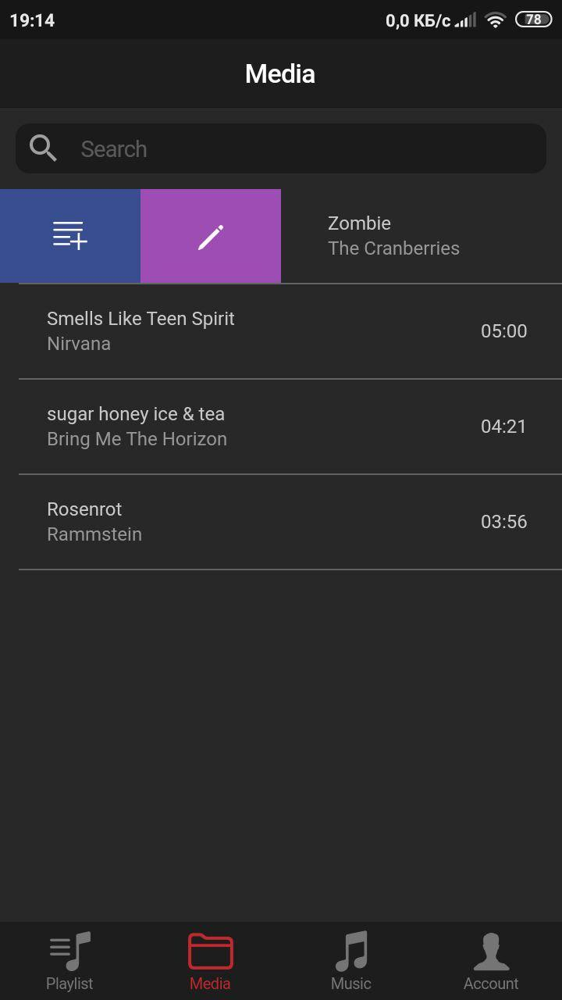</td>
    <td>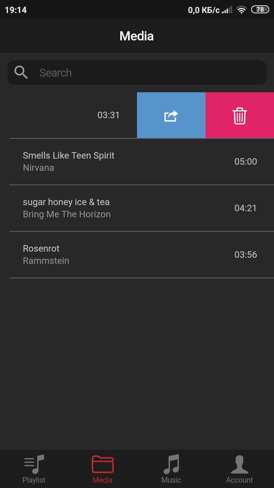</td>
  </tr>
 </table>
 
2.	The application runs in the background.
